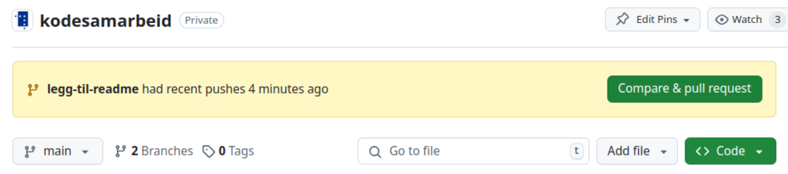
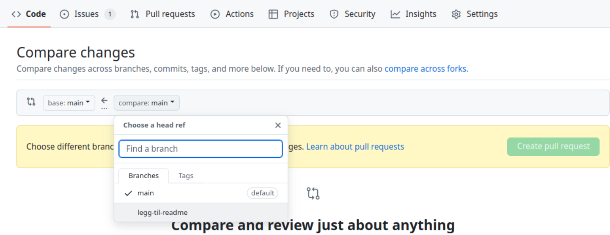
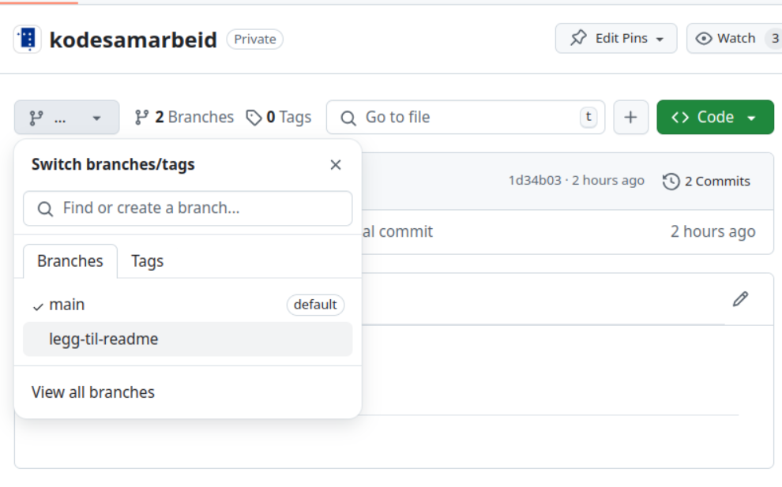
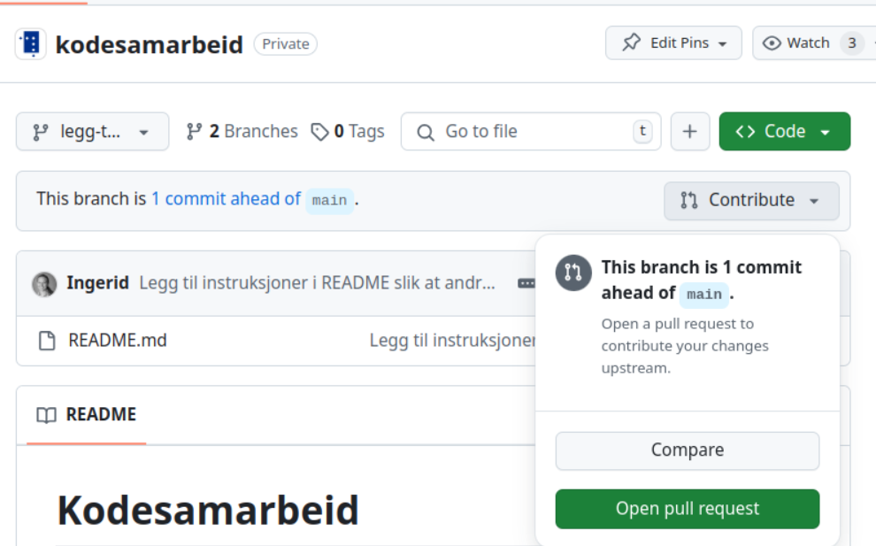
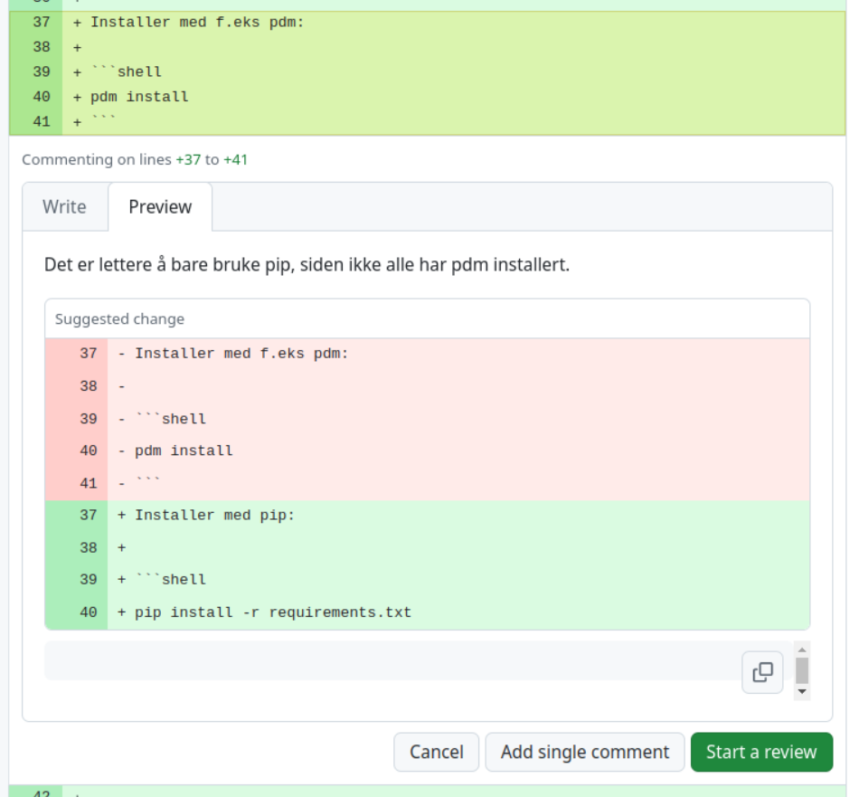

# Kodesamarbeid

Eksempel på arbeidsløype for å samarbeide om kode så enkelt og smertefritt som mulig.

## Plukk eller opprett et issue

I github-repoet viser fanen "Issues" en liste over uløste oppgaver, som vi kan plukke fra om vi ser noe vi kan løse, eller vi kan opprette et nytt issue for en spesifikk oppgave med den grønne knappen helt til høyre.

Issuet bør inneholde en konkret beskrivelse av hva som bør gjøres eller evt. hva resultatet skal være, slik at det er enkelt å avgjøre om oppgaven er løst eller ikke.

I et valgt issue, fra høyre meny, kan man enten delegere oppgaven til noen (klikk på `Assignees`) eller ta ansvar for den selv (klikk på `Assign yourself`).

## Opprett en egen gren

Det er flere måter å opprette en gren på, fra terminalen, i nettleseren, eller i editoren.
Vi starter med å opprette grena lokalt, jobbe lokalt, og deretter dytte alt til repoet på github.

```shell
git switch -c fiks-oppgave
```

## Gjør endringer i repoet

> 👍 **Tommelfingerregel:**
>
> - Skriv store issues som dekker så mye som mulig, så mest mulig blir fikset på én gang
> - Lag store commiter
> - Opprett store PR-er som løser mange små problemer i så mange filer som mulig

## Commit-meldinger: Hva bør de inneholde?

En commit-melding er ideelt sett en kort beskrivelse av hvordan koden har endret seg siden siste commit.

Meldingen er gjerne skrevet i imperativ,
slik at commit-historikken kan leses som en liste med kommandoer som utføres av commitene meldingene hører til.

**Eksempel:**

```shell
git add README.md
git commit -m "Legg til instruksjoner i README slik at andre kan følge samme arbeidsløype."
```

> 🔗 NAV har en fin guide til commit-meldinger: https://github.com/navikt/offentlig/blob/main/guider/commit-meldinger.md

## Push grena til repoet på github-serveren

```shell
git push -u origin fiks-oppgave
```

## Lag en pull request (PR)

En PR er en fin måte å introdusere kodeendringer fra én gren inn til en hovedgren (oftest `main`) i et repo som flere samarbeider på, istedet for å pushe endringer direkte til hovedgrena.

Etter at man har pushet endringer på en gren til github, dukker det opp et gult banner øverst i repoet med en grønn knapp for å åpne en PR til hovedgrena:



Man kan også gå til fanen som heter "Pull requests" og trykke på den grønne knappen "New pull request".
Deretter må man velge hvilken gren man skal flette endringer til, og hvilken gren endringene kommer fra: 

Ellers kan man også velge grena si fra nedtrekksmenyen til venstre: 

Deretter dukker det opp et grått banner med en "Contribute"-knapp. Den knappen lar deg velge "Open pull request": 

### Fordeler med en PR

- Det er en visuell og oversiktlig gjennomgang av filendringene
- Den gjør det mulig for andre å se over før endringene flettes sammen med hovedgrena, som en ekstra kvalitetssikring i tillegg til evt. automatiske tester
- Som utvikler kan man utdype valgene man har tatt i PR-beskrivelsen, hvis det ikke fremkommer direkte av koden eller commit-meldingene
- Som reviewer er det mulig å diskutere endringene og spørre om ting man lurer på, hvis det ikke fremkommer av koden, commit-meldingene eller PR-beskrivelsen
- Som reviewer er det mulig å kommentere spesifikke linjer, og foreslå alternative endringer som kan commites direkte i PR-en

## Be om eller gjør et code review

I høyre meny i PR-en kan man velge "Reviewers" og sette en "Assignee" for PR-en.

Når man gjør et code review, er det god praksis å holde en hyggelig tone selv om man er uenig i valgene som er blitt gjort.

Legg inn kommentarer og spørsmål hvis noe må tydeliggjøres eller oppklares. Kanskje en logisk brist eller skrivefeil har sneket deg inn i koden som raskt kan ordnes så snart utvikleren gjøres oppmerksom på det.

Hvis man ser at noe kan løses på en bedre måte, går det an å velge flere linjer og trykke på "Add suggestion"-ikonet:  



Dersom helt konkrete ting må endres for at koden skal fungere som den skal, klikk på "Review changes"-nedtrekksmenyen og velg "Request changes" slik at "Assignee" får beskjed om at noe må gjøres/endres.

Dersom man er fornøyd med endringene, velger man "Approve" slik at "Assignee" får beskjed om at de kan merge.

### Retningslinjer for å merge

God praksis for PR er å vente med å merge endringene til en reviewer har trykket "Approve", og at "Assignee" er den som merger.

Det er tre måter å merge koden på. Alle resulterer i samme kode på basegrena, men det er noen avgjørende forskjeller i hvordan git-historikken ser ut.

1. "Create merge commit": Alle endringene pakkes inn i en ny merge-commit som fletter de to grenene sammen på basegrena, og utviklergrena beholder alle commitene sine frem til det.
2. "Squash and merge": Alle endringene skvises inn i én commit på basegrena, slik at historikken fra utviklergrena "viskes vekk". Nyttig hvis det var mye prøving og feiling før PR-en.
3. "Rebase and merge": Alle commitene fra utviklergrena flyttes over til basegrena slik at det ser ut som commitene ble gjort kronologisk på basegrena. Utviklergrenas historikk forsvinner.

## Ressurser

- https://ohshitgit.com/
